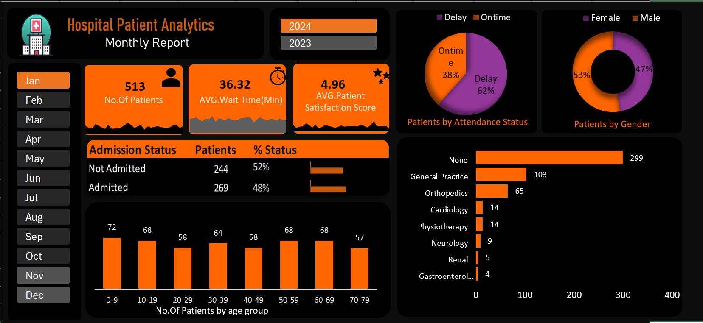

# Hospital-Patient-Analytics-Project
This project analyzes hospital patient data for 2023 and 2024 to understand patient flow, waiting time, and satisfaction levels.

## Objective

- Analyze patient visits across two years
- Understand waiting time and delays
- Measure patient satisfaction
- Identify department referral patterns
- Compare year-over-year performance

## Tools Used

### Microsoft Excel(Advanced)
- Power Query – data cleaning and transformation
- Pivot Tables – data summarization
- Charts & Visuals – bar charts, pie charts, KPI cards
- Slicers – year and month filtering

## Dashboard Preview

## Key insights

- Patient count increased in 2024 compared to 2023
- Average waiting time increased due to higher patient load
- Patient satisfaction improved
- Waiting time increased

## Conclusion

The dashboard shows that while patient demand and satisfaction level improved, waiting time also increased. 
Improving scheduling and operational efficiency can help enhance patient experience.
